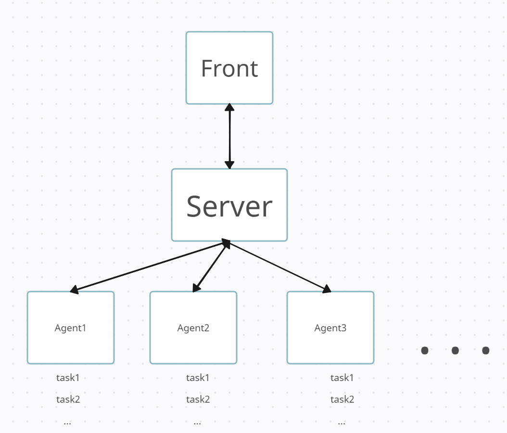

контакты для связи -  телеграмм @ilyaVinokurow

Оглавление 
### Команды для тестирования в терминале
### Структура Работы программы 
### Структура проекта (файлы и папки)
### Как запустить
### Что сделано и не сделано


# Команды для тестирования в терминале

Посылаем значение выражения (exp)
curl -v -d "exp=13" -X POST http://localhost:8000/newtask

!!!!! Есть проблемма при отправке через консоль символа + он заменяется на пробел
в браузере такой проблеммы нет 
curl -v -d "exp=2/2*(2+2)" -X POST http://localhost:8000/newtask
В результате выражение не принимается и считается не валидным и мы получает ответ 400
Решение вводить выражение с плюсов в браузере

get запрос
curl -v -X GET http://localhost:8000/getAgentList

### Структура Работы программы 
Всё общение идёт через http протокол  и Post запросы
(основные части front/front.go agent/agent.go  server/server.go)

Фронт работает с пользоватаелем (через html страницу)обрабатывает запросы и выдаёт результат.
фронт находится на localhost:8000
Фронт передаёт серверу(оркестратору) Таски (выражения для вычисления) и получает ответы от сервера.

Сервер передаёт выражение на вычесление агенту.
Сервер находится на localhost:8010

Агент создаёт новый поток и выполняет в нём выражение.
(начальный агент находится на localhost:8020 )
Количество потоков ограничено количеством потоков процесоора на котором запущен агент

</h1>

# Структура проекта (файлы и папки)
Проект содержит файлы модуля, модуль называется -  last
go.mod  go.sum 
В файле go.mod можно увидеть версию go и необходимые зависимости

README.md srv.png - файлы редми

Папки
/cmd
Из этой папки запускается программа, есть 2 варианта: как монолит 
go run .\cmd\main.go
 и по отдлеьности частями:

/agentmain
go run .\cmd\agentmain\main.go
/frontmain
go run .\cmd\frontmain\main.go

/servermain
go run .\cmd\servermain\main.go  


/agent
Содержит сам агент, который запускается из  .\cmd\main.go

/front
Содержит фронт, который запускается из  .\cmd\main.go
/front/template
Сщдуржит шаблоны(html) которые нужны для взаимоделйствияс пользователем 

/server
Содержит сервер(для оркестрирования) , который запускается из  .\cmd\main.go

# Взаимодействие компонентов (фронта сервера и агента)

    Пользователь передаёт данные в фронт(обрабатывает запросы и посылает нужные запросы сервверу)
    Общаются через пост запросы передачей json
    Сервер(оркестратор) получает таски от фронта и отдаёт агенту, как только получил от него запрос


    папки 
    cmd/agentmain
        frontmain
        servermain - для запуска отдельно каждой части программы 

    ### Как работает программа (пример для монолитнго запуска)

    ```Go
    запускаем фронт сервер и агентов 
    cmd/main.go
        front.StartFront(ctx)
        server.StartSrv(ctx)
	    agent.StartAgent(ctx, port)

    
    front/front.go 
        front.StartFront(ctx)
        запускает 
        restoreCondact()  находится в

        front/savecond.go
            содержит функции
            //сохраняем состояние
            func (d *Data) saveCondact() 

            //восстанавливаем состояние
            func restoreCondact() {

        парсим файл
        стр 97 templ, err := template.ParseFiles("front/template/listtask.html")
        сохраняем в мапу, что бы не читать с диска простоянно  
        data.cashe["listtask"] = templ

        потом можно выдать страницу пользователю
        err := data.cashe["main"].Execute(w, nil)


        // страница ввода выражения
        func (d *Data) new(w http.ResponseWriter, r *http.Request)
        проверяем выражение 
        validExpression(expression)
            содержит функцию
            front/checkValid.go
                validExpression(expression)

            далее добовляем данные и отправляем на сервер 
            data.addData(expression, res)
                //посылаем данные
			    (стр 171) err := d.sendSrv(newData)
        
        Функции обмена данными с сервером:

        //получаем от сервера
        // получаем ответ со значением таски
        func (d *Data) getAnswer(w http.ResponseWriter, r *http.Request)

        // Send посылает даннные через пост в виде json по адресу (используется в других пакетах)
        func Send(a interface{}, urlAdr string) error
    
        // setting страница с настройками выполнения задач
        func (d *Data) setting(w http.ResponseWriter, r *http.Request)
    
        // обновляем список серверов (Агентов)
        func (d *Data) updateAgents(w http.ResponseWriter, r *http.Request)

        // функция которая будет запрашивать сервер о его состоянии и менять глобальную переменную
        func checkSrvStatus()


    server/server.go
        //стартуем сервер и бдем слушать запросы
        func StartSrv(ctx context.Context)
            аналогично фронту сохраняем состояние 
        
        Функции обмена данными:
        // front - server
        // newTask полученная с фронта
        func (o *Orkestrator) newTask(w http.ResponseWriter, r *http.Request)

        // server - agent
        // отдаём задачу агенту
        // агент спаминт нас запросами мы ему отдаём таски
        // это функция по получению Хёртбита и добавления новых агентов и отдачи таски
        // новому агенту
        func (o *Orkestrator) getTask(w http.ResponseWriter, r *http.Request)

        // получаем таску с ответом
        func (o *Orkestrator) sendAnswerTask(w http.ResponseWriter, r *http.Request)

        //послыаем агенту структуру с обновлённым временем выполнения задач
        func (o *Orkestrator) updateTime(w http.ResponseWriter, r *http.Request)

        Оркестратор
        // следим за тасками которые выполняются чтоб не превысили время
        // если  агент отволился то все его задачи сново в очередь отсылаем
        func (o *Orkestrator) MainOrkestrator()

        //отсылаем обновлённый список агентов на сервер если что то изменилось
        func (o *Orkestrator) agentUpdate() 

        //запрашиваем с фронта и посылаем ответ
        // изменяем статус сервера и он сообщает об ошибах (есть или нет)
        func (o *Orkestrator) statusSrv(w http.ResponseWriter, r *http.Request)

    agent/agent.go

        запуск без сохранения состояния, не нужно(задачи храняться на сервере в виде очереди)
        // StartAgent запускает основу с которой будет общаться сервер
        func StartAgent(ctx context.Context, port string) (func(context.Context) error, error) 

        // типа оркестратор в агенте (запускает потоки, как только пришла задача от сервера от сервера)
        // servrConn подключаемся к серверу
        func (a *Agent) servrConn() {
            // горутина которая говорит что данный агент всё ещё жив
            //heartBit
            go func()

            //горутина по получению задач постоянно отправляем запрос если есть потоки и
            //нам приходят задачи через пост в другую функцию
            go func() {

        стр 222 // получаем задачу и запускаем горутину для её выполнения
        func (a *Agent) newTask(w http.ResponseWriter, r *http.Request)

        	//запускаем задачу на выполнение в отдельной горутине
            go func() {
                a.ExecuteTask(tsk)

                стр 259 
                // ExecuteTask решает пример ответ записывает в структуру
                используется скаченный пакет 
                func (a *Agent) ExecuteTask(tsk *front.Task)

                вычисляем время задержки
                // время после которого будет выполнена задача (считаем это время незначительным по сравнению с секундой)
		        timeStop := time.Duration(a.getTimeLimit(tsk.Expression)) * time.Second

                стр 174
                // выдаёт сколько времени надо выполнять задачу в зависимости от знака в выражении
                func (a *Agent) getTimeLimit(exp string) int

        если с фронта пришли новые лимиты или завершается программа то 
        // останавливаем все задачи
        func (a *Agent) reboot(w http.ResponseWriter, r *http.Request)

        // обнавляем лимиты времени выполнения задачи 
        func (a *Agent) newTimeLimit(w http.ResponseWriter, r *http.Request) 
            
```

# Как запустить 

Для запуска нужно go 1.16 ; git ; скачать go get github.com/overseven/go-math-expression-parser

Запуск проводился в терминале в VScode в Windows 10
Данная программа запускается как монолит и не разделена на подпрограммы 
запускается 
go run .\cmd\main.go
Можно также запустить и раздельно фронт сервер и агента
по отдельности фронт (go run .\cmd\frontmain\main.go) сервер (go run .\cmd\servermain\main.go) агента (go run .\cmd\agentmain\main.go )
!!Важно закрывать нужно через Ctl + C так обрабатываются сочетание клавиш и идёт сохраниение в файл, есть задержка перез закрытием 10 миллисекунд

в проекте использую модуль с именем last(нужно проверить включены ли модули 
go env

должно быть 
set GO111MODULE=
или
set GO111MODULE=on)
команда для изменения переменной go env -w GO111MODULE=
 
программа запускалась с версией  go 1.16
со старой может поломаться
что бы запустить со старой надо изменить версию в модуле (файл go.mod)
скачать недостающие зависимости  go mod tidy

если не скачались зависимости то необходимо скачать пакет для вычисления выражения 
github.com/overseven/go-math-expression-parser
go get github.com/overseven/go-math-expression-parser


# Запросы


# Что сделано и не сделано

Бд нет в место неё используется файл и простая очередь в виде массива

0. readme с описанием программы и как запустить 

1. Программа запускается и все примеры с вычислением арифметических выражений корректно работают - 10 баллов.
    - Можно запустить двумя способами: сразу всю программу(go run .\cmd\main.go), 
    по отдельности фронт (go run .\cmd\frontmain\main.go) сервер (go run .\cmd\servermain\main.go) агента (go run .\cmd\agentmain\main.go )
    !!Важно закрывать нужно через Ctl + C так обрабатываются сочетание клавиш и идёт сохраниение в файл, есть задержка перез закрытием 10 миллисекунд
    при запуске агента можно указать порт на котором он будет выполняться 
    Зарезервировнные порты 8000 - для фронта  8010 - для сервера, 
    Если запускать на одном порту то будут ошибки и ничего не запустится

2. Программа запускается и выполняются произвольные примеры с вычислением арифметических выражений - 10 баллов.
    - Примеры желательно задавать через форму, елс и через консоль то могут быть проблемы со знаком + (заменяется на пробел) 
    Как вычисляются и передаются таски можно проследить по логам

3. Можно перезапустить любой компонент системы и система корректно обработает перезапуск (результаты сохранены, система продолжает работать) - 10 баллов.
    - состояние сохраняется  в текстовый файл в формате json

4. Система предосталяет графический интерфейс для вычисления арифметических выражений - 10 баллов
    - Граффический интерфейс расположен по адресу http://localhost:8000/

5. Реализован мониторинг воркеров - 20 баллов
    - Есть мониторинг воркеров(у меня агенты) http://localhost:8000/servers
    Но нет отображения задач которые выполняются на них

6. Реализован интерфейс для мориторинга воркеров - 10 баллов
    - (Не совсем понял что нужно сделать )
    Реализовал выдачу списка работающих агентов curl -v -X GET http://localhost:8000/getAgentList
    Добавить нового агента go run .\cmd\agentmain\main.go 8021  (а конце указываем порт)

7. Вам понятна кодовая база и структура проекта - 10 баллов (это субъективный критерий, но чем проще ваше решение - тем лучше).
Проверяющий в этом пункте честно отвечает на вопрос: "Смогу я сделать пулл-реквест в проект без нервного срыва"
    - Постарался сделать больше коментов, но могут быть не точности обращаться в телеграм см вверху
8. У системы есть документация со схемами, которая наглядно отвечает на вопрос: "Как это все работает" - 10 баллов

9. Выражение должно иметь возможность выполняться разными агентами - 10 баллов
  - Не сделано, выражение пересылается целиком на агент и там вычисляется  